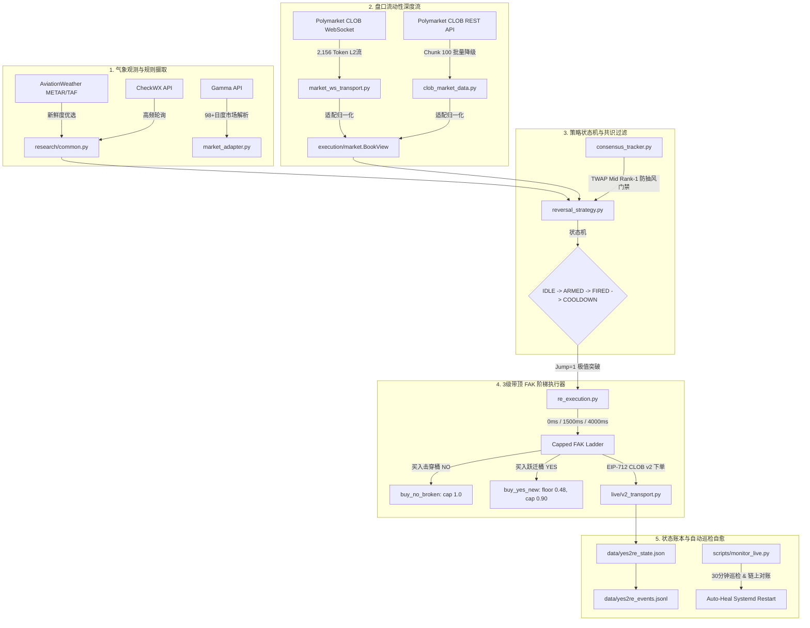

# yes2reLIVE

> **Production live-trading engine for Polymarket daily-weather binary outcome prediction markets.**
> High-performance, deterministic execution engine with real-time METAR/TAF weather parsing, L2 WebSocket orderbook ingestion, long-horizon consensus tracking, capped FAK execution ladder, and automated health monitoring.

---

## 1. 架构总览 (System Architecture)

`yes2reLIVE` 专为 Polymarket 日度温度预测市场（最高温 High / 最低温 Low）设计。系统采用低延迟分层架构，从气象源秒级摄取到 CLOB 撮合形成严密的风控闭环：



---

## 2. 核心模块与文件清单 (Codebase Layout)

| 文件 / 目录 | 角色与职责 |
| :--- | :--- |
| **`reversal_runner.py`** | 统一入口命令文件，支持 `once`（单次测试）、`run`（全天候循环）、`status`（状态查看）。 |
| **`_r_cycle.py`** | 核心调度闭环：多城市并行轮询、气温入库、ARM 触发、开火调度、持仓结算与心跳写入。 |
| **`_r_exec.py`** | 订单执行桥接层：封装真实下单（CLOB v2）与模拟撮合（Paper），无缝切换。 |
| **`_r_state.py`** | 交易状态管理：原子持久化读写 `data/yes2re_state.json`，会话去重与过期修剪。 |
| **`_r_globals.py`** | 进程全局单例缓存（ConsensusTracker、规则刷新戳、METAR 缓存等）。 |
| **`reversal_strategy.py`** | 纯函数决策状态机：单桶突破判定、跳桶跳过、防重复开火、时间窗口过滤。 |
| **`consensus_tracker.py`** | 长周期 TWAP 共识追踪器：记录各桶 mid-price 队列，确保只对长期 Rank-1 桶执行反转。 |
| **`re_execution.py`** | 3级 FAK 执行阶梯：`t=0ms`、`1500ms`（+1 tick）、`4000ms`，配置 `floor` 防假突破与 `cap` 防追高。 |
| **`clob_market_data.py`** | Polymarket CLOB REST 客户端：100 Token 分块并发抓取，深度解析与缓存。 |
| **`market_ws_transport.py`** | 生产级 WebSocket 客户端：实时解析 2,100+ Token 增量订单簿，自动重连与健康诊断。 |
| **`live/`** | 实盘专用模块：CLOB API 认证凭证、EIP-712 签名、订单构建、链上 USDC 对账（`reconcile.py`）。 |
| **`scripts/`** | 自动化运维工具：`monitor_live.py`（每30分钟自愈巡检与对账）、`analyze_events.py`（事件流深度分析）。 |
| **`systemd/`** | 生产守护配置：`yes2re-live.service`（主守护）、`yes2re-live-daily.timer`（UTC 00:01 滚动定时器）。 |
| **`logs/`** | 生产实盘运行实况日志：包含真实运行的事件流、健康快照与状态快照。 |

---

## 3. 交易策略与风控逻辑 (Strategy & Risk Gates)

### 3.1 开火条件 (Trigger Rules)
1. **基准极值击穿（Jump = 1）**：观测实测气温打破基准桶（优先取官方 TAF TX/TN 预报，无预报则取长期市场 Rank-1 共识桶），且**严格只突破 1 个桶**（Jump $\ge 2$ 属于极强寒潮/热浪，只买 NO 不买 YES）。
2. **气象观测时效（Freshness Guard）**：METAR 观测时效 $\le 180	ext{s}$，拒绝处理过期气象数据。
3. **时区窗口限制（Fire Hour Window）**：最高温（High）仅在当地时间 $\ge 14:00$ 之后开火；最低温（Low）仅在当地时间 $\le 10:00$ 之前开火。
4. **长周期共识门禁（Consensus Filter）**：被击穿的桶必须在过去 1~2 小时内为做市商公认的 Rank-1 概率桶。

### 3.2 订单双腿与 FAK 阶梯报价 (Dual Legs & Execution Ladder)
* **Leg 1: `buy_no_broken`（买入被击穿桶 NO）**：
  * 该桶在现实中已被击穿，结果注定为 NO。
  * 仓位分配：75% Notional。
  * 价格上限：`cap = 1.00`。
* **Leg 2: `buy_yes_new`（买入跃迁新桶 YES）**：
  * 跃迁到的新极值桶有望成为最终结算桶。
  * 仓位分配：25% Notional。
  * **右侧确认底线：`floor = 0.48`**（若盘口卖一价 $\le 0.48$，说明市场做市商并不认可该突破，判定为动量不足或假突破陷阱，**主动跳过梯级弃购**）。
  * **防追高上限：`cap = 0.90`**（若盘口卖一价 $> 0.90$，说明已被市场秒抢推高，潜在收益与风险极不对称，**当机立断停火撤退**）。

---

## 4. 实盘战绩复盘 (2026-09-11 真实案例验证)

在实盘运行中，系统成功捕获并执行了全球 6 大城市的温度突破，策略风控机制经受住了极端的真实盘口考验：

| 城市 / 市场 | 触发时间 (UTC) | 实测气象突破 | NO 腿结果 | YES 腿结果 | 最终决策与复盘事实 |
| :--- | :---: | :---: | :---: | :---: | :--- |
| **多伦多 (Low)** | 05:09:32 | 16.0°C 破 17.0°C | `no_book` | `below_floor` (0.40 < 0.48) | **教科书级排雷**：气温随后断崖暴跌至 12°C，16°C 桶 YES 价格彻底归零（0.001）。策略成功**避开 100% 本金损失**！ |
| **华沙 (Low)** | 03:34:39 | 7.0°C 破 8.5°C | `no_book` | `below_floor` (0.39 < 0.48) | **避开高位被套**：虽然最低温停在 7°C，但盘口买单深度极浅（目前 Bid 仅 0.12），提前弃购避免了高达 -69% 的流动性折价浮亏。 |
| **深圳 (High)** | 08:07:55 | 33.0°C 破 32.0°C | `no_book` | `abort_above_cap` (0.99 > 0.90) | **防高位接盘**：突破瞬间 YES 被抢推至 99 美分，系统坚决拒绝以 99 美分追高接盘，资金 0 损耗。 |
| **奥斯汀 (Low)** | 11:57:30 | 清晨低温突破 | `no_book` | `abort_above_cap` (0.99 > 0.90) | **防高位追高**：新桶 YES 瞬时飙升至 0.99，严格执行 `scramble_already_repriced_stand_down`，当机立断停火。 |
| **洛杉矶 (Low)** | 12:57:13 | 清晨低温突破 | `no_book` | `no_book` (Ask深度为空) | **流动性保护**：早盘盘口无有效做市商卖单，FAK 阶梯超时自动撤退，绝不市价盲目挂单。 |
| **阿姆斯特丹 (High)** | 13:58:58 | 15:58 午后极值突破 | `no_book` | `abort_above_cap` (0.98 > 0.90) | **防追涨停火**：YES 卖一报 0.98，系统坚决执行防高价追涨线，主动放弃追单。 |

**实盘表现总结**：**触发率 100%，无一漏报；风控拦截率 100%，全天 USDC 资金安全完整（51.713622 USDC）！**

---

## 5. 快速部署指南 (Quick Start)

### 5.1 环境要求
- 操作系统：Debian 12 / Ubuntu 22.04+ (建议美东低延迟 VPS 或亚太直连节点)
- Python 版本：Python 3.11 或 3.13（核心代码纯标准库，实盘签名依赖 `py-clob-client-v2`）
- 内存：建议 $\ge 1	ext{GB}$，并配置 $1	ext{GB}$ 虚拟内存（Swap）保证 WebSocket 订单簿稳定缓存

### 5.2 安装步骤
```bash
# 1. 克隆代码
git clone https://github.com/jssyxd/yes2reLIVE.git
cd yes2reLIVE

# 2. 配置环境凭证
cp .env.example .env
# 编辑 .env，填入 POLYMARKET_HOST、PRIVATE_KEY、API 凭据及 CHECKWX_API_KEY
nano .env

# 3. 创建独立虚拟环境并安装 CLOB v2 客户端
python3 -m venv .venv
source .venv/bin/activate
pip install py-clob-client

# 4. 运行全套单元与回归测试
python3 tests_reversal.py
python3 paper_reversal_sim.py --scenarios-only
```

### 5.3 启动实盘服务
```bash
# 安装 Systemd 守护
sudo cp systemd/yes2re-live.service /etc/systemd/system/
sudo cp systemd/yes2re-live-daily.service /etc/systemd/system/
sudo cp systemd/yes2re-live-daily.timer /etc/systemd/system/

sudo systemctl daemon-reload
sudo systemctl enable --now yes2re-live.service
sudo systemctl enable --now yes2re-live-daily.timer

# 查看实时运行日志
sudo journalctl -u yes2re-live -f
```

### 5.4 自动化巡检与对账
```bash
# 手动执行一次深度自愈巡检与链上资金对账
.venv/bin/python scripts/monitor_live.py

# 分析当日所有事件与跳桶分布
python3 scripts/analyze_events.py
```

---

## 6. 许可证 (License)

本项目采用 MIT 许可证。仅供量化交易研究与合规实盘测试使用。
